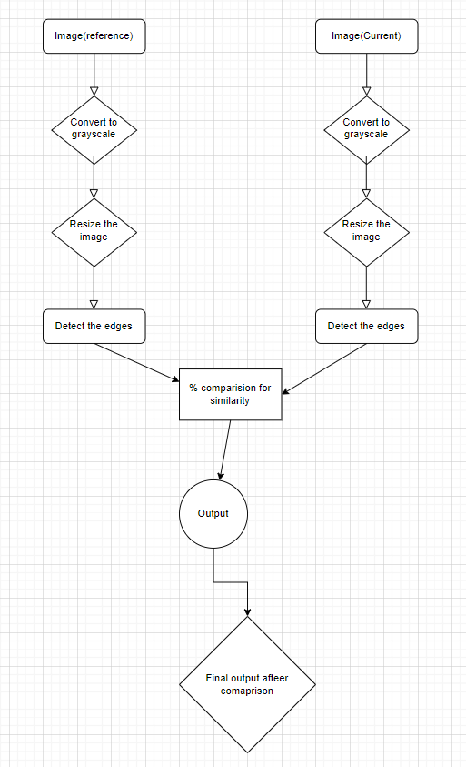

# CSEP PROJECT

# Traffic Light Controlling

## 20CS3018 Ayush Rathore

### Introduction

The conventional Traffic light Control system is time-based, it stays green in a lane for a particular amount of time for that lane, and at that moment other lanes signals are red. After that, the green light turns red, and the other lane light turns green. The problem is, it assumes that on all the lanes, the traffic is equivalent. This system can be very annoying if there is little to no vehicle on a lane and still its light is green based on the conventional traffic control. Whereas if there is huge traffic on some other lane, still it will have to wait for the turn of its lane’s light to turn green. This project aims to make the lights smart by turning the green signal on the most congested lane. The program aims to minimize traffic jams at crossroads based on the traffic intensity of lanes.

### Overview

This project aims to control the traffic light by image processing. A camera is used to detect vehicles using images. Image processing is a better technique to control the state change of the traffic light. It avoids the time wasted by a green light on an empty road. It is also more reliable in estimating vehicle presence because it uses actual traffic images. It visualizes the practicality.

### Method Used

We will be using two images for each pathway. The captured image is the current condition on the road, while the other is the reference image with an empty road. Both the images will be processed and then compared according to the flow chart given to analyse the traffic conditions.

### Algorithm

1. We have a reference image and the image to be matched is continuously captured
using a camera that is installed at respective pathways.
2. The images are pre-processed in two steps as follows
a. Images are rescaled to 700x700 pixels.
b. The above rescaled images are converted from RGB to gray.
c.  Then edge detection of the above image is carried out. 
3. The output images of previous step are matched using pixel to pixel matching
technique.
4. After matching, the timing allocation is done by comparing the percentage of
change of each lane and the resultant sequence is stored in a list
5. The resultant list will tell which pathway should be green first and for the longest amount time.

### Conclusion

The Traffic Light Controlling technique proposed here overcomes all the limitations of the earlier (in use) methods used for controlling the traffic. Earlier, automatic traffic control used timers which had the drawback of time being wasted due to green light on an empty road. This technique avoids this major problem. This project demonstrates that image processing is a far more efficient method of traffic control as compared to traditional techniques.